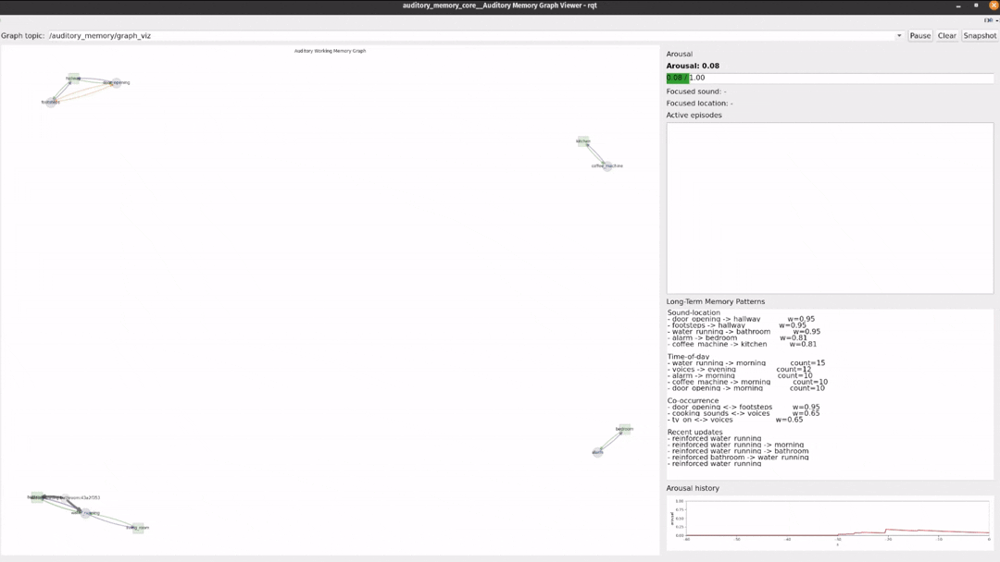
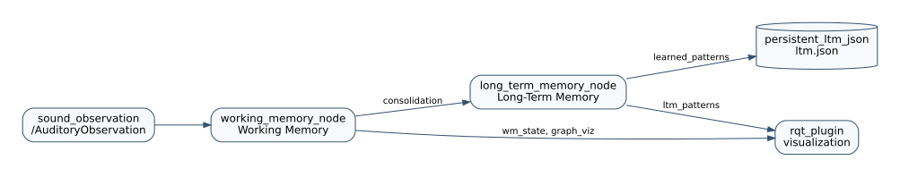

# Auditory Memory System

Contextual auditory memory system for ROS 2.

The system does not classify raw audio. It receives pre-processed
`AuditoryObservation` messages from an upstream perception pipeline or the
included simulator, then maintains Working Memory, Long-Term Memory, pattern
learning, novelty, arousal, focus, and rqt visualization.



## What It Does

- Groups recent sounds as active episodes in Working Memory.
- Learns persistent sound, location, time, and co-occurrence patterns in
  Long-Term Memory.
- Estimates whether a sound is familiar, expected in its location, and expected
  at the current time.
- Raises novelty, arousal, and focus when an event violates learned patterns.
- Shows current state and learned patterns in an rqt plugin.

## Packages

- `auditory_memory_msgs`: ROS 2 message definitions.
- `auditory_memory_core`: memory nodes, simulators, and rqt plugin.
- `auditory_memory_bringup`: launch files.

## Build

From the workspace root:

```bash
cd /home/lab/auditory_ws
colcon build --symlink-install
source install/setup.bash
```

## Launch

Launch memory nodes and rqt:

```bash
cd /home/lab/auditory_ws
source install/setup.bash
ros2 launch auditory_memory_bringup auditory_memory.launch.py
```

Launch without rqt:

```bash
ros2 launch auditory_memory_bringup auditory_memory.launch.py start_rqt:=false
```

Use a custom Long-Term Memory file:

```bash
ros2 launch auditory_memory_bringup auditory_memory.launch.py \
  ltm_path:=/home/lab/auditory_ws/auditory_memory_data/ltm.json
```

Run the simulator in another terminal:

```bash
cd /home/lab/auditory_ws
source install/setup.bash
ros2 run auditory_memory_core auditory_day_simulator
```

Run the empty-memory learn-then-anomaly demo:

```bash
rm -f /tmp/auditory_ltm_demo.json
ros2 launch auditory_memory_bringup auditory_memory.launch.py \
  ltm_path:=/tmp/auditory_ltm_demo.json
```

In another terminal:

```bash
ros2 run auditory_memory_core auditory_day_simulator --ros-args \
  -p demo_mode:=learn_then_anomaly \
  -p speed_multiplier:=1.0
```

## Flow



Source: [`docs/auditory_memory_flow.sysml`](docs/auditory_memory_flow.sysml)

When a sound arrives, Working Memory creates or updates an active episode. That
episode is evaluated against Long-Term Memory to compute familiarity, location
congruence, and time expectedness. When it becomes inactive, it is consolidated
and reinforces persistent patterns.

## Algorithm Brief

Novelty combines three learned evidence signals:

```text
novelty =
  0.40 * (1.0 - familiarity)
+ 0.45 * (1.0 - location_congruence)
+ 0.15 * (1.0 - time_expectedness)
```

Arousal accumulates novelty and contextual urgency evidence, then decays over
time. Focus is selected from active episodes using novelty, location
incongruence, intensity, and contextual urgency.

## Main Topics

- `/sound_observation`: `auditory_memory_msgs/AuditoryObservation` input.
- `/auditory_memory/wm_state`: Working Memory state, focus, and arousal.
- `/auditory_memory/graph_viz`: JSON for rqt graph visualization.
- `/auditory_memory/consolidation`: finished episodes for Long-Term Memory.
- `/auditory_memory/ltm_patterns`: JSON summary of learned patterns.

## Details

- [Algorithm and memory](docs/algorithm.md): Working Memory, Long-Term Memory,
  novelty, arousal, contextual urgency, and pattern learning.
- [ROS reference](docs/reference.md): topics, messages, rqt plugin, simulators,
  and timestamp semantics.
